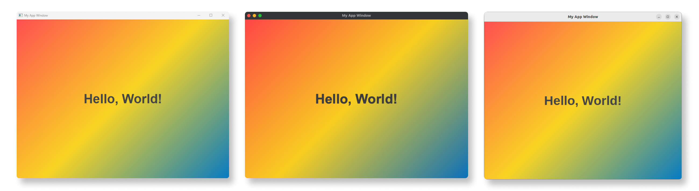

# deskgui

[](LICENSE)

**deskgui** simplifies the development of web-based desktop applications for MacOS, Windows and Linux. It optimizes binary sizes by using native webviews, ensuring efficient performance without bundling an external web engine.



### 🛠️ deskgui is currently under development. 🛠️

## Features

deskgui offers the following key features:

- **Web content**: Users can seamlessly integrate any HTML, JS and CSS-based front-end framework for their interfaces.

- **Event Control**: Monitor multiple events and manage the app's behavior accordingly.
  
- **Resources embedding**: Embed resources into your application's binary. This means you can bundle resources like HTML, CSS, and JavaScript directly into your application, reducing external dependencies and ensuring a more streamlined deployment.

- **Webview flexibility**: Create multiple windows and webviews as needed, and customize and manipulate them dynamically to adapt to your application's requirements on the fly.

- **Thread safety**: It guarantees thread safety when dealing with webviews and windows, allowing you to execute operations across various threads without the burden of synchronization concerns.
  
### Platforms

deskgui currently supports:

| Platform                 | Technologies            |
| :----------------------- | :---------------------- |
| Windows                  | [Microsoft Edge WebView2](https://developer.microsoft.com/en-us/microsoft-edge/webview2/) |
| macOS                    | [WebKit](https://webkit.org/)        |
| Linux                    | [WebKitGTK](https://webkitgtk.org/)  |

## Platform-specific notes

### Linux and BSD

For development purposes on Linux and BSD systems, ensure you have the required libraries by running the following commands:

**Debian-based systems:**

- `sudo apt install libgtk-3-dev libwebkit2gtk-4.0-dev`

**Fedora-based systems:**

- `sudo dnf install gtk3-devel webkit2gtk4.0-devel`

**BSD-based systems (FreeBSD):**

- `sudo pkg install webkit2-gtk3`

### MacOS
On macOS, you're in luck! WebKit is a native component of the macOS operating system. This means that you won't need to worry about additional installations, and everything should work without problems.

### Windows
For versions of Windows prior to Windows 11, make sure that both developers and end-users have the WebView2 runtime installed on their system. You can download and install it from the [official Microsoft WebView2 download page](https://developer.microsoft.com/microsoft-edge/webview2/).

## How to build
deskgui uses [CMake](https://cmake.org/) to configure and generate the necessary build files.

To build the project, execute the following commands:
```
cmake -S . -B build
cmake --build build
```

## Examples
Explore more practical implementations in [examples](./examples).

### Basic example
```cpp
#include <deskgui/app.h>

using namespace deskgui;

int main() {
  // Create app 🏠
  App app;

  // Create window 🖥️
  auto window = app.createWindow("Window");
  window->setTitle("My awesome app!");
  window->setMinSize({400, 400});
  window->setSize({800, 800});

  // Create webview 🧩
  auto webview = window->createWebview("Webview");
  webview->navigate("https://www.google.com");
  
 // Show the window once the webview content is loaded to prevent a white screen 🧭
  webview->connect<deskgui::event::WebviewSourceChanged>([&window]() { window->show(); });

  // Listen window resize event to resize the webview 📐
  window->connect<deskgui::event::WindowResize>(
      [&webview](const deskgui::event::WindowResize& event) { webview->resize(event.size); });

  // Run the application! 🚀
  app.run();
}
```

## Roadmap

The future development of deskgui includes the following planned features:

- [ ] Drag and drop
- [ ] App Tray
- [ ] App Signing
- [ ] Native Notifications
- [ ] And more exciting features to come! 🚀

## Licenses

Copyright (c) 2023 - deskgui

MIT License
